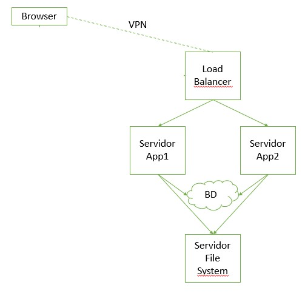
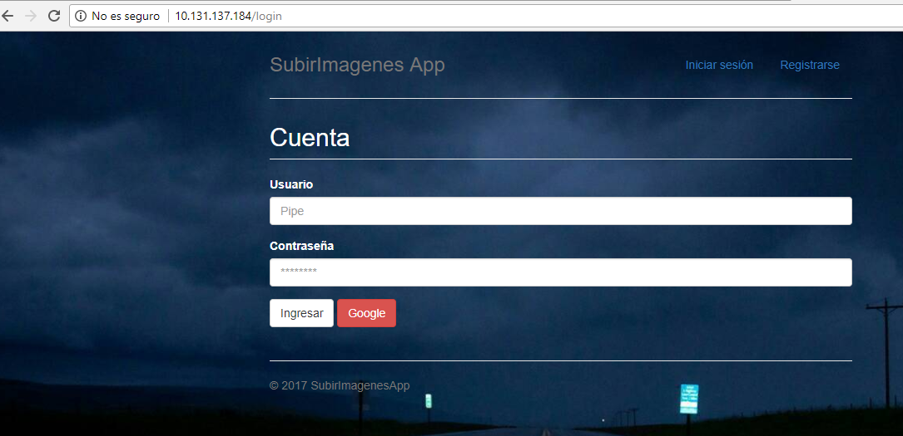
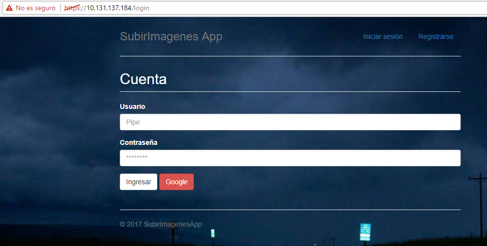
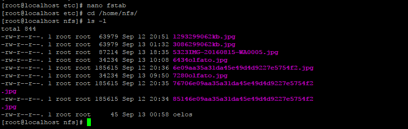

# QA Disponibilidad

Se configura la herramienta HAPROXY como balanceador de carga y la herramienta de NFS para el servidor de archivo.

- Arquitectura Base:

# HAPROXY:

• Proxy inverso (permite que un browser con conexión a la VPN, pueda ingresar a los App Server 10.131.137.179 o 10.131.137.177).
• Se utiliza el algoritmo source para disponibilidad en Failover (Un servidor responde a todas las peticiones, y si este se cae el otro se encarga de recibir las peticiones hasta que el App Server1 entre de nuevo en producción)
• Permite recibir comunicaciones seguras (https) con un certificado auto firmado el cual se encuentra en la ruta /etc/ssl/private/mydomain.pem
• Estadísticas de tiempo de estado de vida (UP o DOWN), las cuales se pueden ver en la ruta 
	http://10.131.137.184/haproxy?stats
	usuario admin y contraseña admin

Nota: estas conexiones se deben realizar por medio de una conexión VPN.

# Instalación y configuración HAPROXY

- Instalación del HAPROXY:

	$ sudo yum install haproxy

- Configuración HA
	
	$ sudo nano /etc/haproxy/haproxy.cfg

- Donde se agregan las siguientes líneas:

* Para crear el certificado auto firmado HTTPS, se siguen las instrucciones de la página:
	http://fosshelp.blogspot.com.co/2016/11/how-to-create-pem-file-for-haproxy.html

- configuración en el HAPROXY

Global
    ca-base /etc/ssl/certs
    crt-base /etc/ssl/private
    ssl-server-verify none
    ssl-default-bind-ciphers ECDH+AESGCM:DH+AESGCM:ECDH+AES256:DH+AES256:ECDH+A$
    ssl-default-bind-options no-sslv3
    tune.ssl.default-dh-param 2048

frontend https-in
    bind *:443 ssl crt /etc/ssl/private/mydomain.pem
    default_backend http_app

backend https_app
    mode tcp
    option http-server-close
    option forwardfor
    reqadd X-Forwarded-Proto:\ https
    reqadd X-Forwarded-Port:\ 443
    option forwardfor if-none
    balance source
    server  app1 10.131.137.177:443 check
    server  app2 10.131.137.179:443 check

* Para conexiones HTTP

backend http_app
    mode http
    option httplog
    balance source
    server  app1 10.131.137.179:80 check
    server  app2 10.131.137.177:80 check

frontend http-in
    bind *:80
    default_backend http_app

backend http_app
    mode http
    option httplog
    balance source
    server  app1 10.131.137.179:80 check
    server  app2 10.131.137.177:80 check}

- Para las estadisticas

defaults
    stats enable
    stats hide-version
    stats realm HAproxy Statistics
    stats uri /haproxy?stats
    stats auth admin:admin

- Luego se inicia y se valida que el servicio de HAPROXY este arriba, con los comandos

	$ sudo systemctl start haproxy

	$ sudo systemctl start haproxy

# Instalación y configuración NFS Server

Se siguen las instrucciones de la siguiente página:
	https://www.howtoforge.com/nfs-server-and-client-on-centos-7

- Instalación del NFS

	$ sudo yum install nfs-utils

* Configuración de NFS Server 

- Se crea la carpeta que sea desea compartir
	
	$ sudo mkdir /home/nfs

- Se asignan los permisos necesarios para que la carpeta pueda ser accedida por los usuarios

	$ sudo chmod -R 777 /home/nfs

- Se configuran los siguientes servicios

	$ sudo systemctl enable rpcbind
	$ sudo systemctl enable nfs-server
	$ sudo systemctl enable nfs-lock
	$ sudo systemctl enable nfs-idmap
	$ sudo systemctl start rpcbind
	$ sudo systemctl start nfs-server
	$ sudo systemctl start nfs-lock
	$ sudo systemctl start nfs-idmap

- Se configura la carpeta que se va a compartir en la ruta /etc/exports y se agrega la línea

	$ sudo nano /etc/exports

	/home/nfs       *(rw,sync,no_root_squash,no_all_squash)

- Se reinicia y se valida que el servicio nfs-server esté arriba

	$ sudo systemctl restart nfs-server
	$ sudo systemctl status nfs-server

* Configuración de NFS Client

- Se asignan los permisos a la carpeta donde va a ser montada la carpeta compartida del File Server, en este caso es:

	$ sudo chmod -R 777 /home/agarci45/proyecto/st0263_subirImagenesApp/public/uploads/

- Se configuran los siguientes servicios

	$ sudo systemctl enable rpcbind
	$ sudo systemctl enable nfs-server
	$ sudo systemctl enable nfs-lock
	$ sudo systemctl enable nfs-idmap
	$ sudo systemctl start rpcbind
	$ sudo systemctl start nfs-server
	$ sudo systemctl start nfs-lock
	$ sudo systemctl start nfs-idmap

- Se configura el archivo fstab para que el montaje de la carpeta se realice automáticamente, al momento de iniciar el sistema operativo

	$ sudo nano /etc/fstab

	10.131.137.194:/home/nfs /home/agarci45/proyecto/st0263_subirImagenesApp/public/uploads nfs     defaults 0 0

# Casos de estudio

Caso de estudio:
- HAPROXY (10.131.137.184) con certificado auto firmado
- AppServer1 (10.131.137.179)
- AppServer2 (10.131.137.177)
- BD en Nube (mlab)
- File Server (10.131.137.194)
- En el AppServer1 hay una app corriendo por el puerto 3006
- En el AppServer2 hay otra app corriendo por el puerto 3006

- Para comprobar el funcionamiento, en un browser (conectado a la VPN) entre:
	http://10.131.137.179:3006 
	y
	http://10.131.137.177:3006

- Para validar el HAPROXY se ingresa por la ruta:
	http://10.131.137.184

donde debe responder uno de los dos servidores de aplicación y como se muestra en las siguientes imágenes:

* HTTP

* HTTPS

- Las pruebas con el File Server se realiza, cuando desde la aplicación se sube una imagen y la guarda en la carpeta creada en el servidor de archivos:

