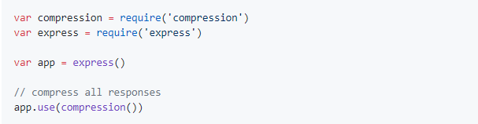
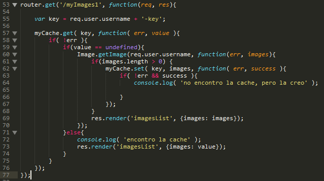
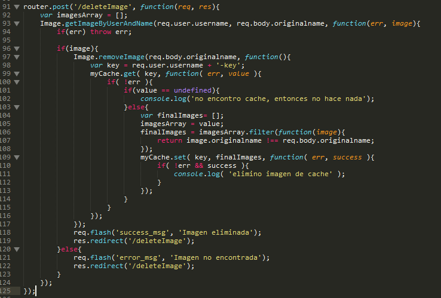
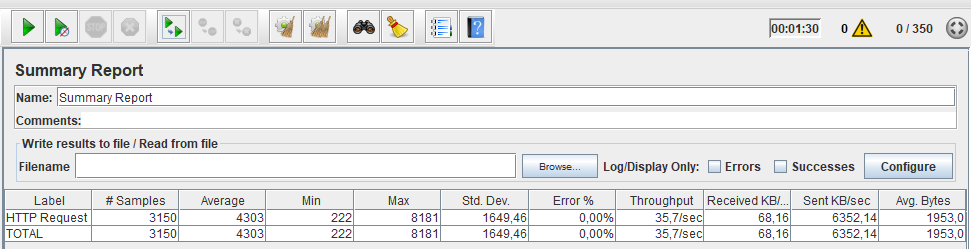
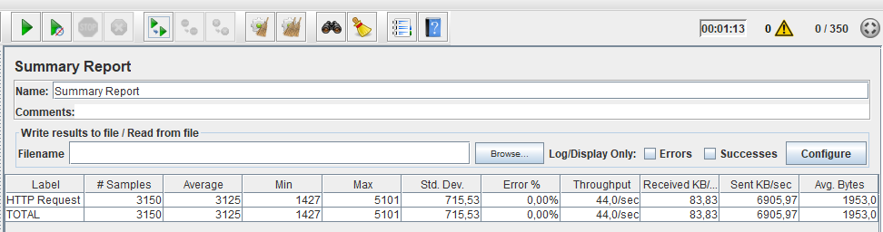
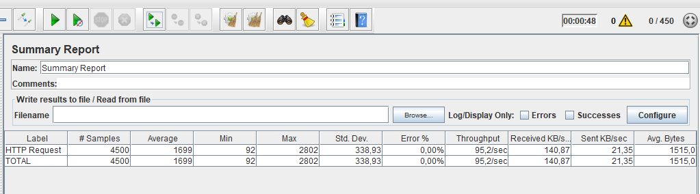
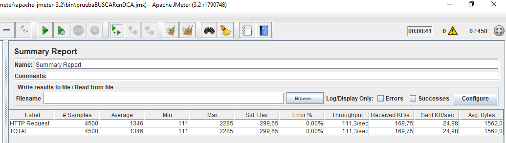
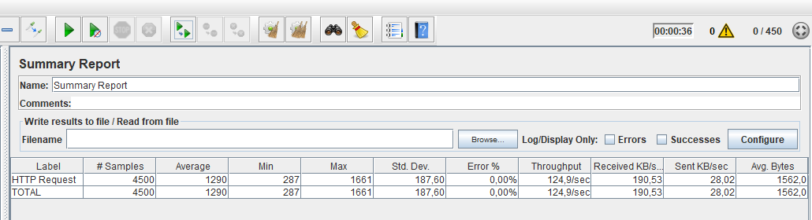
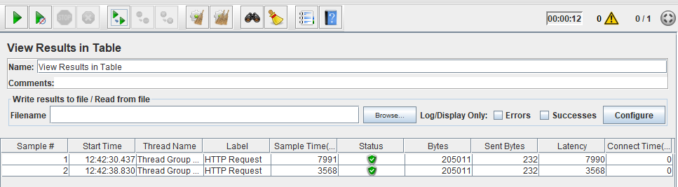
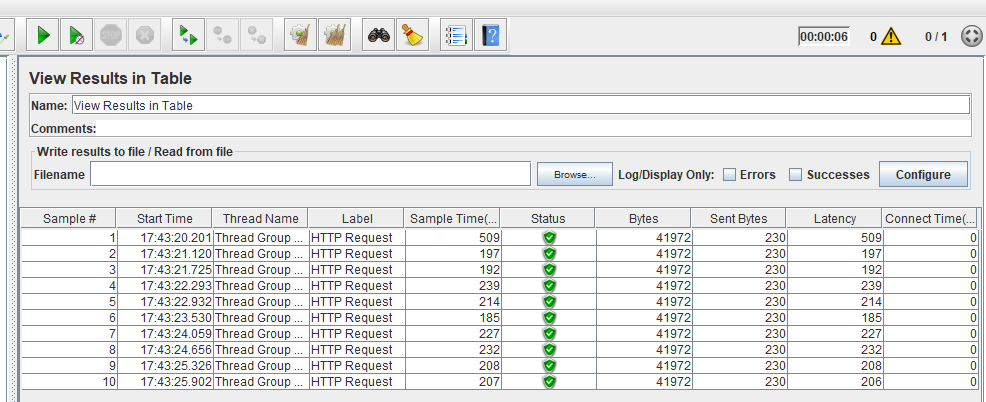

# Mejora en Rendimiento

Para mejorar el rendimiento de la aplicación, se implementó **compresión de assets** y **cache**. Se realizaron pruebas por medio de la herramienta [JMeter](http://jmeter.apache.org/) para 2 escenarios en 3 momentos diferentes.

Para la compresión de assets se utilizó el módulo de node llamado **compression**, el cual comprime los cuerpos de respuesta para todas las peticiones. Las siguientes líneas de cógido se añaden en **app2.js**

Para la parte de cache se utilizó el módulo **node-cache** el cual crea una cache interna, es decir en el servidor que levanta la aplicación, pero actúa como memcached que es directamente la cache en memoria ram.

La cache se implementó de la siguiente manera:

Cuando un usuario consulta sus imágenes, se crea una cache con las imágenes que hay almacenadas para ese usuario en la base de datos. A partir de ese momento, la caché cuenta con un tiempo de vida de 1 minuto. Si el usuario sube más imágenes y las consulta antes de que termine el minuto, no las va a visualizar; luego de que pase el minuto, cuando el usuario vuelva a consultar sus imágenes, se vuelve a crear la caché con todas las imágenes subidas hasta el momento y por lo tanto, puede ver las nuevas imágenes. Por otro lado, si el usuario elimina una imagen, la cache se actualiza inmediatamente con las imágenes que se encuentran almacenadas para ese usuario en la base de datos.

* Cache en búsqueda de imágenes:

Aquí podemos observar lo explicado anteriormente. En el momento en que el usuario consulta sus imágenes, se verifica si ya existe cache, de ser así el usuario observa las imágenes que ha subido hasta el momento, en caso contrario, se crea la cache con las imágenes que hayan en la base de datos para ese usuario.

* Cache en eliminación de imágenes:

Cuando el usuario elimina una imágen, inmediatamente se actualiza la caché con las imágenes contenidas para ese usuario en la base de datos.

## Escenario 1 - Subir imágenes

* Sin compresión de assets ni cache:

Múltiples usuarios concurrentes subiendo una imagen. Aquí se observa 350 usuarios subiendo una imagen durante 9 veces. Se obtiene un **throughput** de 35,7/seg, es decir, se están subiendo 35 imágenes por segundo. El tiempo promedio (**latencia**)es de 4303 ms.

* Con compresión de assets:

Para los mismos 350 usuarios subiendo una imagen se observa una leve mejora en el **throughput**, el cual paso de 35,7/seg a 44,0/seg. También se puede ver que mejoró el **tiempo promedio**, que pasó de 4303ms a 3125ms.

## Escenario 2 - Buscar imágenes

* Sin compresión de assets ni cache:

Múltiples usuarios concurrentes buscando múltiples imágenes. Se observan 450 usuarios buscando varias imágenes durante 10 veces, donde se observa un **throughput** de 95,2/seg y un **tiempo promedio** de 1699 ms.

* Con compresión de assets:

Para los mismos 450 usuarios buscando una imagen se observa una leve mejora en el **tiempo promedio**, el cual pasó de 1699ms a 1346ms. Igualmente en el **throughput** pasa de 95,2/seg a 111,3/seg.

* Con cache:

Igualmente para 450 usuarios buscando una imagen se observa una mejora en el **tiempo promedio** que pasó de 1346ms a 1290ms y en el **throughput**, el cual pasó de 111,3/seg a 124,9/seg.

## Otros ejemplos

Finalmente, se puede observar claramente como mejora la **latencia** cuando se realiza una búsqueda por medio de cache.

* Ejemplo1: La primera vez que un usuario busca sus imágenes obtiene un tiempo de respuesta de 7990 ms; en esta primera búsqueda no está utilizando cache. Una vez realizada la primera búsqueda, se crea la cache, la cual se utiliza cuando el usuario vuelve a realizar una consulta de sus imágenes, en la cual se obtiene un tiempo de respuesta de 3568 ms.

* Ejemplo2: En este ejemplo podemos observar igualmente una mejora en la **latencia**, donde la primera vez que el usuario consulta sus imágenes, obtiene una **latencia** de 509 ms; a partir de este momento se crea la cache y en las próximas consultas se obtiene una mejora notable debido a que ya se está haciendo uso de la cache.

