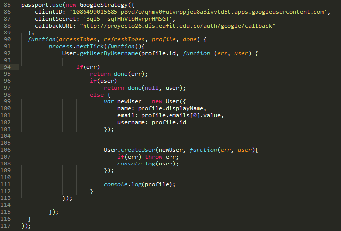

# QA Seguridad

Se configuran los servicios de autenticación externa con Google Auth, se solicita certificado a LetsEncrypt y se valida que el firewall de los servidores esté arriba y sus configuraciones.

# Certificado HTTPS

• Se solicita el certificado de seguridad en LetsEncrypt sobre un dominio existente con la herramienta cerbots (la cual estaba previamente instalada en el servidor), con lo cual se crean los archivos fullchain y privkey, los cuales se concatenan para que las peticiones realizadas por HTTPS, respondan correctamente.

- El proceso para solicitar el certificado y concatenar los archivos, se realizan con los pasos alojados en el GitHub por el profesor Edwin Montoya

	https://github.com/edwinm67/st0263eafit/tree/master/qa-security

	$ sudo /root/certbot-auto certonly --cert-path /etc/letsencrypt/archive/st0263.dis.eafit.edu.co --expand -d proyecto26.dis.eafit.edu.co

	$ sudo /root/certbot-auto certonly -d st0263.dis.eafit.edu.co  --expand -d proyecto26.dis.eafit.edu.co

- Se concatenan los archivos y se almacena el nuevo, en la ruta /etc/haproxy/certs

	$ sudo cat /etc/letsencrypt/archive/proyecto26.dis.eafit.edu.co-0003/fullchain1.pem /etc/letsencrypt/archive/proyecto26.dis.eafit.edu.co-0003/privkey1.pem > /etc/haproxy/certs/proyecto26.pem

# Configuración HAPROXY para conexiones HTTP y HTTPS

	$ sudo nano /etc/haproxy/haproxy.cfg

	frontend https
        bind proyecto26.dis.eafit.edu.co:443    ssl     crt     /etc/haproxy/certs/proyecto26.pem
        acl host_proyecto26 hdr(host) -i proyecto26.dis.eafit.edu.co
        use_backend proyecto26_cluster if host_proyecto26

    frontend http *:80
		OPCION2: si quiere que también reciba por http:
        acl host_st0263 hdr(host) -i st0263.dis.eafit.edu.co
        acl host_proyecto24 hdr(host) -i proyecto24.dis.eafit.edu.co
        acl host_proyecto26 hdr(host) -i proyecto26.dis.eafit.edu.co
        use_backend proyecto26_cluster if host_proyecto26

    backend proyecto26_cluster
        balance leastconn
        option httpclose
        cookie JSESSIONID prefix
        server node6 10.131.137.184:80

# Revisión Firewall locales

• Se revisan que el firewall de todos los servidores a nuestro cargo esté activo:

	$ sudo service firewalld status

Se revisan los servicios activos del firewall de cada uno de los servidores:

- Servidor IP pública:

Podemos observar que este firewall tiene el servicio de ssh y los puertos 80 y 443 TCP permitidos en la zona pública, que son necesarios para conexiones HTTP y HTTPS	

- Servidor HAPROXY privado

	
Podemos observar que este firewall tiene los servicios de ssh, http, https y nfs permitidos en la zona pública, los cuales son requeridos para el funcionamiento del HAPROXY		

- Servidor de Aplicación

Podemos observar que este firewall tiene los servicios de ssh, https y los puertos 80, 3000, 3001, 3002, 3006 y 3009 TCP y UDP permitidos en la zona pública, los cuales fueron abiertos para las entregas del proyecto 1.	

- Servidor de Archivos

Podemos observar que este firewall tiene los servicios de ssh, https, rpc-bind, nfs, mountd y los puertos 2049 TCP y UDP permitidos en la zona pública, los cuales fueron abiertos para el correcto funcionamiento del NFS	

# Google Auth

Para la autenticación con Google se utilizó el módulo [passport-google-oauth](http://passportjs.org/docs/google), por medio del cual se solicita al usuario el permiso de utilizar la aplicación **Subir Imágenes App**.

En primer lugar se debe entrar a [Google Developers Console](https://accounts.google.com/signin/v2/identifier?service=cloudconsole&passive=1209600&osid=1&continue=https%3A%2F%2Fconsole.developers.google.com%2F%3Fref%3Dhttp%3A%2F%2Fpassportjs.org%2Fdocs%2Fgoogle&followup=https%3A%2F%2Fconsole.developers.google.com%2F%3Fref%3Dhttp%3A%2F%2Fpassportjs.org%2Fdocs%2Fgoogle&flowName=GlifWebSignIn&flowEntry=ServiceLogin) donde se debe **aceptar el consentimiento de OAuth**, **habilitar la API de Google+** y luego **crear una credencial** en la cual se deben establecer 2 cosas: 

* La URI de origen de la aplicación cliente, es decir, el lugar desde donde se realiza la petición para ingresar con la cuenta de Google:

		http://proyecto26.dis.eafit.edu.co

* La URI de redireccionamiento autorizado, es decir, el lugar a donde va a ser redireccionado el usuario cuando se autentique con la cuenta de Google.

		http://proyecto26.dis.eafit.edu.co/auth/google/callback

Una vez creada la credencial, se nos generan 2 campos:

* ID de cliente
* Secreto de cliente

Estos campos se configuran en la función ofrecida por passport con la estrategia de Google

Cuando el usuario introduce el correo y contraseña de su correspondiente cuenta de Google, se hace una validación por medio de la función **getUserByUsername**; si el usuario ya existe en la base de datos, simplemente es redireccionado a la pagina principal de **Subir Imágenes App**, en caso contrario, se crea el usuario con la información pertinente de éste y consiguientemente es redireccionado a la aplicación.

Como se dijo anteriormente, si el usuario ingresa la información de la cuenta correctamente, será redireccionado exitosamente a la página principal, en el caso contrario será redireccionado a la página de login.

# Casos de estudio

- Con la solicitud del certificado en LetsEncrypt y la configuración del HAPROXY, se observa en las siguientes imágenes que la aplicación responde por el dominio 

	http://proyecto26.dis.eafit.edu.co 
	y por 
	https://proyecto26.dis.eafit.edu.co

- HTTPS:

Nota: se presenta un inconveniente con el certificado, ya que en la mayoría de ocasiones no se reconoce como válido, como se muestra en la siguiente imagen:

- HTTP:

